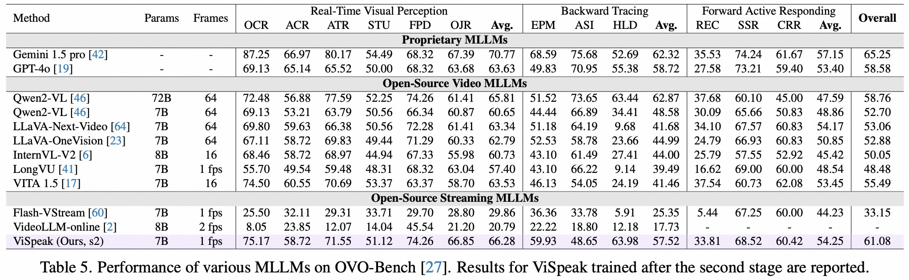

# ViSpeak: Visual Instruction Feedback in Streaming Videos
- Paper: [Arxiv](https://arxiv.org/abs/2503.12769)
- ViSpeak-Bench: [GitHub](https://github.com/HumanMLLM/ViSpeak-Bench)
- Huggingface: [ViSpeak-s2](https://huggingface.co/fushh7/ViSpeak-s2), [ViSpeak-s3](https://huggingface.co/fushh7/ViSpeak-s3), [ViSpeak-Instruct](https://huggingface.co/datasets/fushh7/ViSpeak-Instruct) (Coming Soon), [ViSpeak-Bench](https://huggingface.co/datasets/fushh7/ViSpeak-Bench) (Coming Soon)
- ModelScope: [ViSpeak-s2](https://modelscope.cn/models/fushh7/ViSpeak-s2), [ViSpeak-s3](https://modelscope.cn/models/fushh7/ViSpeak-s3), [ViSpeak-Instruct](https://modelscope.cn/datasets/fushh7/ViSpeak-Instruct) (Coming Soon), [ViSpeak-Bench](https://modelscope.cn/datasets/fushh7/ViSpeak-Bench) (Coming Soon)

## 👀 ViSpeak Overview

<p align="center">
    
</p>

Recent advances in Large Multi-modal Models (LMMs) are primarily focused on offline video understanding. Instead, streaming video understanding poses great challenges to recent models due to its time-sensitive, omni-modal and interactive characteristics. In this work, we aim to extend the streaming video understanding from a new perspective and propose a novel task named **Visual Instruction Feedback** in which models should be aware of visual contents and learn to extract instructions from them. For example, when users wave their hands to agents, agents should recognize the gesture and start conversations with welcome information. Thus, following instructions in visual modality greatly enhances user-agent interactions. To facilitate research, we define seven key subtasks highly relevant to visual modality and collect the **ViSpeak-Instruct** dataset for training and the **ViSpeak-Bench** for evaluation. Further, we propose the **ViSpeak** model, which is a SOTA streaming video understanding LMM with GPT-4o-level performance on various streaming video understanding benchmarks. After finetuning on our ViSpeak-Instruct dataset, ViSpeak is equipped with basic visual instruction feedback ability, serving as a solid baseline for future research.

#### 🌟 Contributions in ViSpeak

1. We propose a novel streaming video understanding task named Visual Instruction Feedback, which requires the model to actively respond to visual contents. This task greatly enhances human-agent interactions.

2. To support exploration, we manually collect the ViSpeak-Bench benchmark and the ViSpeak-Instruct training dataset. We also provide some analysis based on the evaluation results of existing models.

3. We also propose a strong baseline ViSpeak for the new task, which is finetuned from an existing omni-modal model with three-stage finetuning. ViSpeak not only preserves offline understanding capacities but also achieves SOTA performance on streaming video understanding benchmarks.

<p align="center">
    
</p>

## 📈 Experimental Results

#### 📍 Model Zoo

- We provide our checkpoints at Huggingface and ModelScope

|   Model    |                             Link                             | Size |
| :--------: | :----------------------------------------------------------: | :--: |
| ViSpeak-s2 | [Huggingface](https://huggingface.co/fushh7/ViSpeak-s2) [ModelScope](https://modelscope.cn/models/fushh7/ViSpeak-s2) |  7B  |
| ViSpeak-s3 | [Huggingface](https://huggingface.co/fushh7/ViSpeak-s3) [ModelScope](https://modelscope.cn/models/fushh7/ViSpeak-s3) |  7B  |

- Our model is built upon [VITA 1.5](https://github.com/VITA-MLLM/VITA). To use the model, uses should:
  - Download [audio-encoder](https://huggingface.co/VITA-MLLM/VITA-1.5) and [visual encoder](https://huggingface.co/OpenGVLab/InternViT-300M-448px)
  - And modify the `config.json` file

#### 📍 Results

<p align="center">
    
</p>

<p align="center">
    
</p>

<p align="center">
    
</p>

## 📐 Demo

```
python demo.py --model_path /your/path/to/ViSpeak-s3/ --video demo.mp4
```

- The output will be:

```
Welcome! I'm ready to help you with any issue you might have. 3.9792746113989637
```

## 📏Evaluating on MLLM Benchmarks

#### 📍 Offline Benchmarks

- Download benchmark data.

- Modify the model path of `vispeak_qwen2` in `VLMEvalKit/vlmeval/config.py`

```
vispeak_series = {
    'vispeak_qwen2': partial(ViSpeakQwen2, model_path='/path/to/model'),
}
```

- Then, evaluating on benchmarks:

```
cd VLMEvalKit
export PYTHONPATH=/your_path_to_ViSpeak/ViSpeak-main
CUDA_VISIBLE_DEVICES=0 python run.py --data MME --model vispeak_qwen2 --verbose
CUDA_VISIBLE_DEVICES=0 python run.py --data MVBench --model vispeak_qwen2 --verbose --nframe 64
CUDA_VISIBLE_DEVICES=0 python run.py --data Video-MME --model vispeak_qwen2 --verbose --nframe 64
```

#### 📍 Online Benchmarks

- Download benchmark data first.

- Then, evaluating on benchmarks:

```
# StreamingBench
cd StreamingBench/scripts
export PYTHONPATH=/your_path_to_ViSpeak/ViSpeak-main
bash eval.sh

# OVO-Bench
cd OVO-Bench
export PYTHONPATH=/your_path_to_ViSpeak/ViSpeak-main
bash ViSpeak_inference.sh
```
#### 📍 ViSpeak-Bench

- Download benchmark data from ViSpeak-Bench.

- Then, evaluating on benchmarks:

```
python -m torch.distributed.launch --use_env --nproc_per_node 1 --nnodes 1 ViSpeak_bench.py --model_path /path/to/ViSpeak-s3  --video_folder_path /path/to/ViSpeak-Bench
```

- The evaluation is based on GPT-4o, thus users should first get an API key. More evaluation instructions please see [ViSpeak-Bench](https://github.com/HumanMLLM/ViSpeak-Bench).

## ⭐ Training

#### Our environment

```
pytorch==2.4.0+cu121
transformers==4.44.2
numpy==1.23.5

# other packages
accelerate
decord
deepspeed
Jinja2
ninja
numpy
pillow
flash_attention
```

#### Data Preparation

- To reproduce the stage 3 fine-tuning, users should organize the data as follows:

```
|--ViSpeak-Instruct
|    |--annotations
|    |  |--Anomaly_Warning_HIVUA_train.json
|    |  |--Gesture_Understanding_trainv3_7k.json
|    |  |--social_i_qa_merged_4k.json
|    |  |--Anomaly_Warning_oops_train.json
|    |  |--HumorQA_train_2k.json
|    |  |--interruption_text_training_data.json
|    |  |--socialiq_2K.json
|    |  |--wake_up_text_training_data_split.json
|    |  |--SMILE_1k.json
|    |  |--socialiq_our_anno_1k.json
|    |  |--intentqa_5k.json
|    |  |--reference_text_training_data.json
|    |--FunQA
|    |  |--test
|    |  |--train
|    |  |--val
|    |--HIVAU
|    |  |--videos
|    |  |  |--ucf-crime
|    |  |  |  |--videos
|    |  |  |  |  |--Abuse001_x264.mp4
|    |  |  |--xd-violence
|    |  |  |  |--videos
|    |  |  |  |  |--xxx.mp4
|    |--IntentQA
|    |  |--videos
|    |--SMILE
|    |  |--videos
|    |--social-iq
|    |  |--videos
|    |--UAL-Bench
|    |  |--uag_oops
|    |  |--uag_oops_instruct
|    |--self_collected_data
|    |  |--20250211_envideo
|    |  |--20250212_envideo
|    |  |--20250213_envideo
|    |  |--20250214_envideo
|    |  |--20250216_envideo
|    |  |--20250219_envideo
|    |  |--20250220_envideo
|    |  |--20250221_envideo
|    |  |--20250222_envideo
|    |  |--20250224_envideo
|    |  |--Jester_videos
|    |  |--self_collected_gestures
```

- `annotations` and `self_collected_data` can be found in our [Huggingface]() and [ModelScope]().
- `FunQA`: https://huggingface.co/datasets/fesvhtr/FunQA
- `HIVAU`: https://github.com/pipixin321/HolmesVAU
  - After downloading the videos, please originize the videos as above.
- `IntentQA`: https://github.com/JoseponLee/IntentQA
- `SMILE`: https://github.com/kaist-ami/SMILE-Dataset
- `social-iq`: https://www.kaggle.com/datasets/mathurinache/social-iq
- `UAL-Bench`: https://drive.google.com/drive/folders/1eE_ngd-E6rjdHz0KKttJATzsdxv4Wf_e?usp=sharing
- Paths in `vispeak/config/dataset_config.py` should be modified accordingly.

- The training script is `script/train/finetune_qwen_stage3_nodes.sh`

### ✒️ Citation

If you find our work helpful for your research, please consider citing our work.   

```bibtex
@article{fu2025vispeak,
  title={ViSpeak: Visual Instruction Feedback in Streaming Videos},
  author={Fu, Shenghao and Yang, Qize and Li, Yuan-Ming and Peng, Yi-Xing and Lin, Kun-Yu and Wei, Xihan and Hu, Jian-Fang and Xie, Xiaohua and Zheng, Wei-Shi},
  journal={arXiv preprint arXiv:2503.12769},
  year={2025}
}
```


## &#x1F4E3; Statement

**ViSpeak is trained on large-scale open-source corpus, and its output has randomness. Any content generated by ViSpeak does not represent the views of the model developers. We are not responsible for any problems arising from the use, misuse, and dissemination of ViSpeak, including but not limited to public opinion risks and data security issues.**


## 📜 Related Works

Explore our related researches:
-  **[HumanOmni]** [HumanOmni: A Large Vision-Speech Language Model for Human-Centric Video Understanding](https://github.com/HumanMLLM/HumanOmni)
-  **[R1-Omni]** [R1-Omni: Explainable Omni-Multimodal Emotion Recognition with Reinforcement Learning](https://github.com/HumanMLLM/R1-Omni)
-  **[Omni-Emotion]** [Omni-Emotion: Extending Video MLLM with Detailed Face and Audio Modeling for Multimodal Emotion Analysis](https://arxiv.org/abs/2501.09502)


## 👍 Acknowledgement
ViSpeak is built with reference to the following outstanding works: [VITA 1.5](https://github.com/VITA-MLLM/VITA) and many other awesome datasets! Thanks！

## 📜 License

- Our models and code are under the Apache License 2.0.
- But our self-collected videos are under [**CC BY-NC-SA 4.0**](https://creativecommons.org/licenses/by-nc-nd/4.0/) license.

